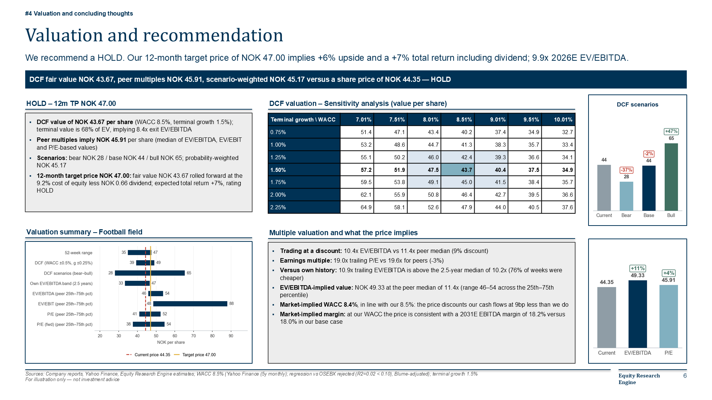
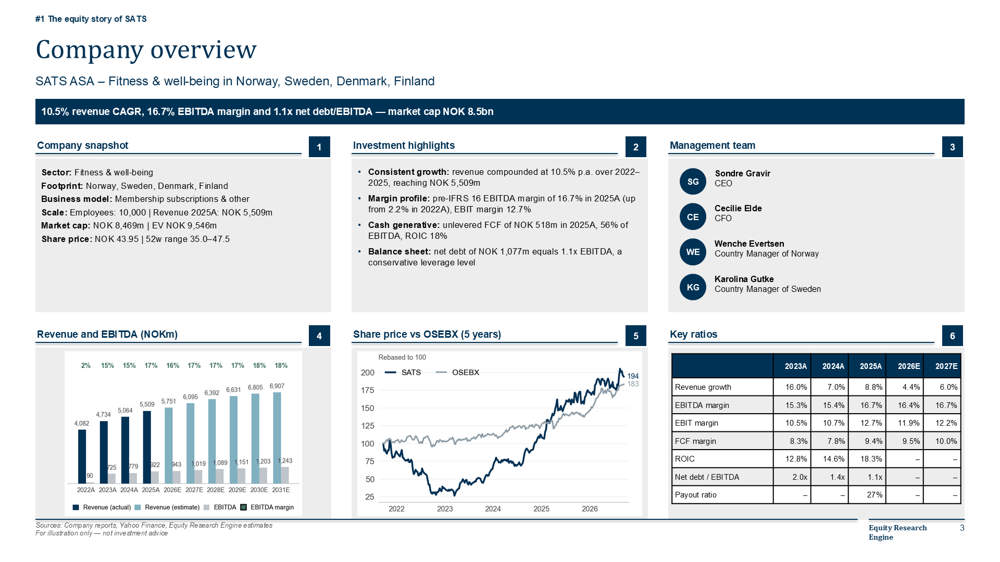
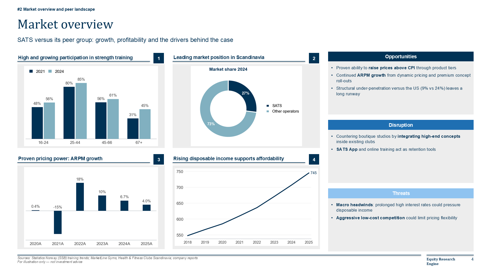
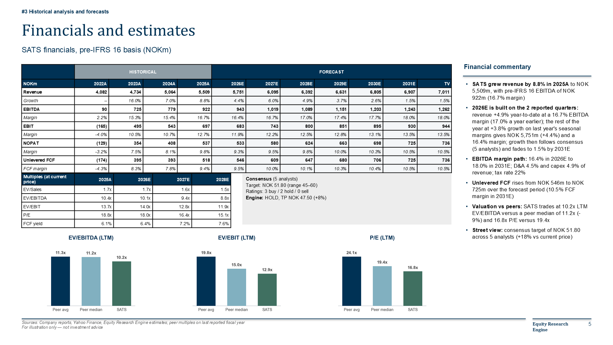
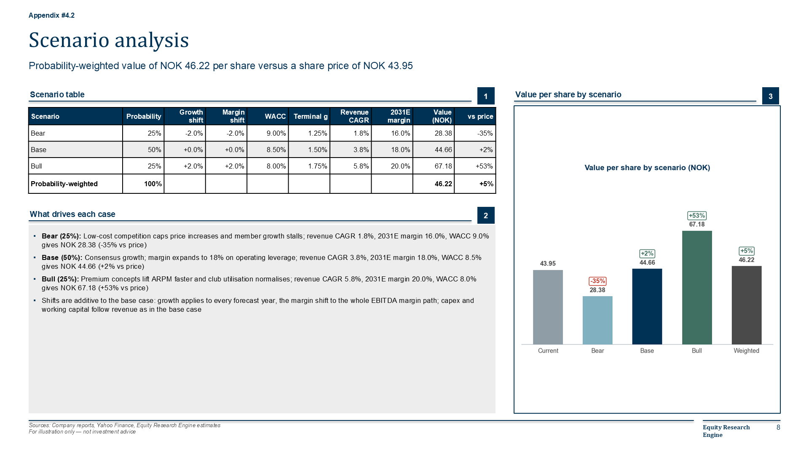
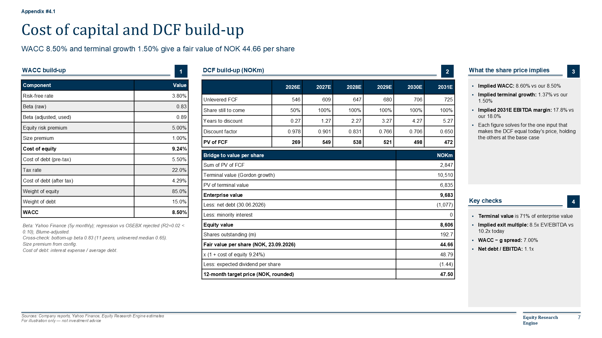
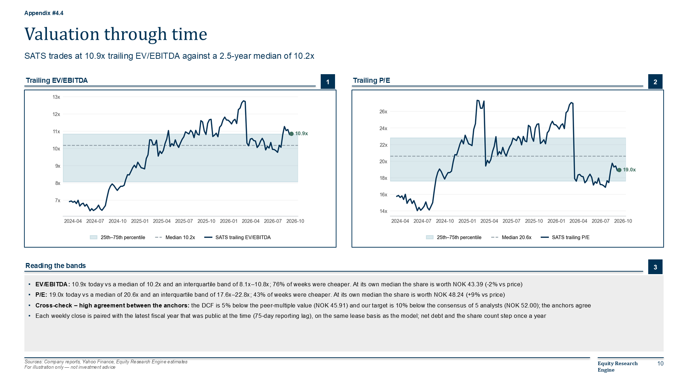
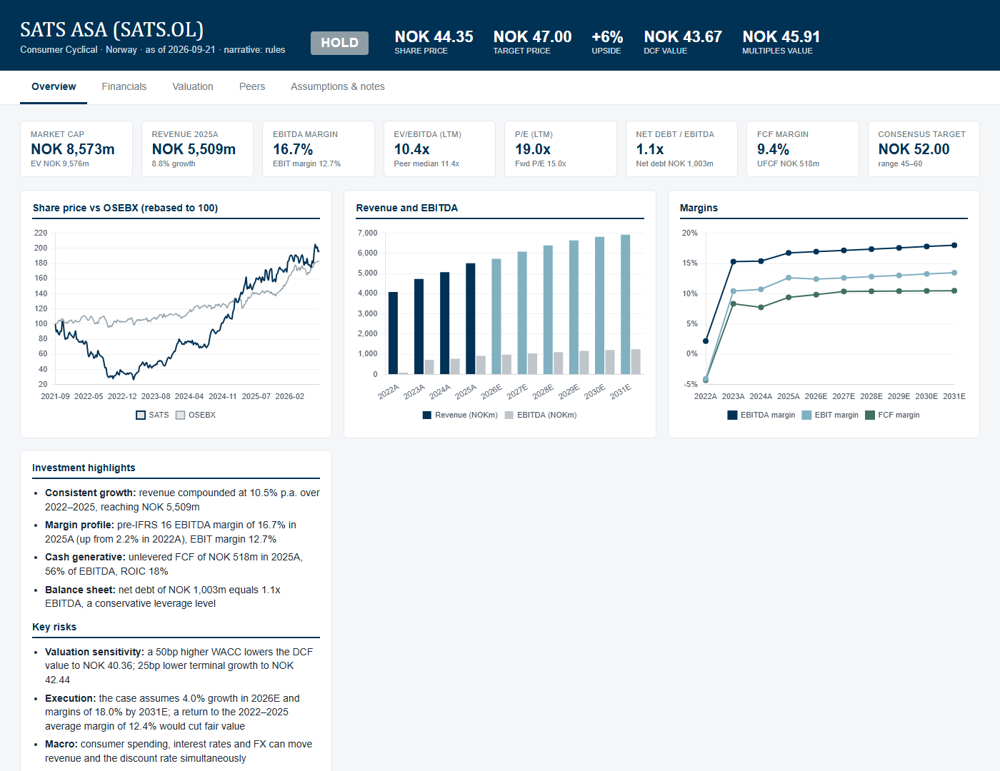
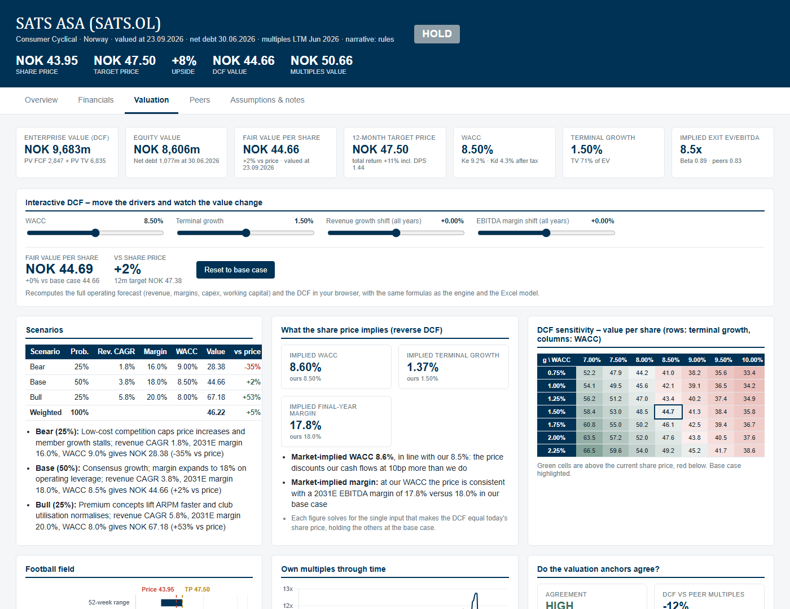
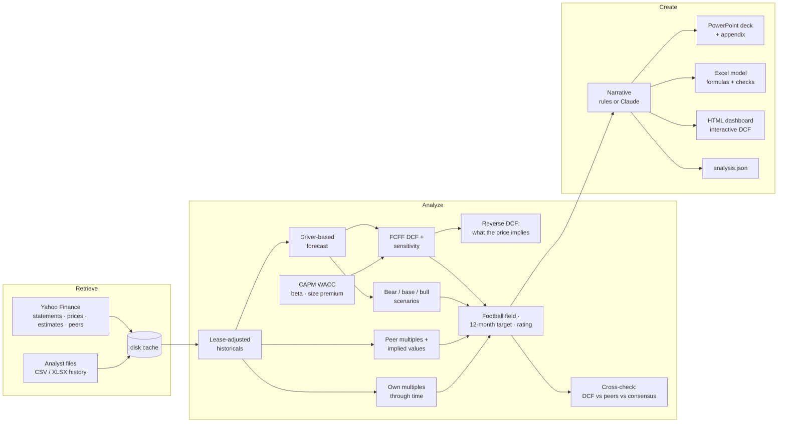

# Equity Research Engine

[](https://github.com/oscarschjelderup-sketch/equity-research-engine/actions/workflows/ci.yml)

**One command turns a ticker into a sell-side style investment case: a PowerPoint deck with appendix, an Excel
valuation model with live formulas and integrity checks, an interactive dashboard and a JSON audit trail.**

```bash
eqr run SATS.OL --render --pdf
```



The project mirrors how an equity research analyst works — *retrieve* data, *analyze* it into a forecast and a valuation,
*create* the deliverables — and automates the mechanical 80% so the analyst can spend time on judgement: peers,
assumptions, the story. It grew out of the Pareto Securities equity research case competition (SATS ASA, February 2026),
where the deck format below was the required template.

| | |
|---|---|
|  |  |
|  |  |
|  |  |
|  |  |

## What it does



1. **Retrieve** – pulls four years of statements, five years of weekly prices, consensus estimates, price targets and
   the peer group from Yahoo Finance (no API key), caches everything on disk, and merges any longer history the
   analyst supplies as a spreadsheet.
2. **Analyze** – rebuilds the accounts on a *pre-IFRS 16 basis* (rent above EBITDA, leases out of net debt), derives
   forecast drivers from consensus and history, estimates beta and WACC (with a size premium), runs an unlevered DCF
   with a 7×7 sensitivity grid, **bear / base / bull scenarios** and a **reverse DCF** (the WACC, growth and margin the
   share price implies), computes peer multiples on a consistent basis and the company's **own multiples through time**,
   and turns it all into a football field, a **12-month target price** and a BUY/HOLD/SELL rating on expected total
   return – with a **cross-check** that says how far the DCF, the peers and the consensus agree.
3. **Create** – writes the four fixed case slides (Company overview, Market overview, Financials and estimates,
   Valuation and recommendation) plus cover, team slide and a four-slide appendix in a Nordic sell-side layout; an
   Excel model in which every forecast, scenario and target-price cell is a formula, guarded by an integrity-check
   sheet; and a self-contained dashboard with sliders that recompute the DCF in the browser.

Every number in the deck can be traced to a statement line or a YAML assumption — see [docs/methodology.md](docs/methodology.md).

## Quick start

```bash
git clone https://github.com/oscarschjelderup-sketch/equity-research-engine.git && cd equity-research-engine
uv sync --extra ai --extra dev      # exact, locked environment (uv.lock); or: pip install -e ".[ai,dev]"

eqr run SATS.OL --render --pdf      # deck + Excel + dashboard + JSON, slides exported to PNG, deck to PDF
eqr analyze SATS.OL                 # valuation summary in the terminal, no files
eqr screen SATS.OL KID.OL BOUV.OL   # watch-list: rating, target price, implied WACC, agreement (+ CSV)
eqr init NHY.OL                     # commented starter config for a new case (index chosen from the ticker suffix)
eqr run NHY.OL --narrative claude   # let Claude write the qualitative text (needs ANTHROPIC_API_KEY)
```

Outputs land in `output/<TICKER>/`:

| File | Content |
|---|---|
| `<TICKER>_deck.pptx` / `.pdf` | Cover, team, four case slides and appendix (DCF build-up, scenarios, peer table, valuation through time); native tables, editable |
| `<TICKER>_model.xlsx` | Inputs → Historicals → Forecast → WACC → DCF → Scenarios → Peers → Football field → Checks, all linked by formulas |
| `<TICKER>_dashboard.html` | Tabs for overview, financials, valuation (interactive DCF, scenarios, reverse DCF, heat-mapped sensitivity, own multiples, cross-check), peers, assumptions |
| `analysis.json` | Every input, intermediate and output – the audit trail |
| `charts/`, `slides/` | Chart PNGs and rendered slides (`--render` needs PowerPoint or LibreOffice) |

A ticker with no config runs on defaults (benchmark index from the ticker suffix, no peers – the deck then shows the
company's own growth, margins, cash flow and returns instead of peer benchmarking). A YAML config in `configs/` gives
the analyst control over everything; the bundled configs for [SATS](configs/SATS.OL.yaml), [Kid](configs/KID.OL.yaml),
[Bouvet](configs/BOUV.OL.yaml) and [Mowi](configs/MOWI.OL.yaml) are complete examples, with outputs in `examples/`.
A guided tour is in [docs/walkthrough.md](docs/walkthrough.md).

## The analyst stays in charge

```yaml
peers:
  - {ticker: BFIT.AS, name: Basic-Fit, group: Global fitness}
  - {ticker: EPR.OL,  name: Europris,  group: Nordic consumer}
assumptions:
  forecast_years: 6
  terminal_growth: 0.015
  ebitda_margin_target: 0.18    # the analyst's view; null = hold near the 3-year average
  lease_treatment: operating    # pre-IFRS 16 basis (default) | financial
  terminal_method: gordon       # or value_driver: NOPAT x (1 - g/RONIC) / (WACC - g)
wacc:
  risk_free: 0.038
  equity_risk_premium: 0.05
  beta_method: regression       # rejected automatically when R² < 0.10 → Yahoo beta
  size_premium: 0.01            # or auto: 0 / 0.75% / 1.5% / 2.5% by market cap
scenarios:
  - {name: Bear, probability: 0.25, growth_shift: -0.02, margin_shift: -0.02, wacc_shift: 0.005, note: "Low-cost competition caps pricing"}
  - {name: Base, probability: 0.50}
  - {name: Bull, probability: 0.25, growth_shift: 0.02, margin_shift: 0.02, wacc_shift: -0.005, note: "Premium concepts lift ARPM"}
market:                          # analyst-supplied charts and bullets for the market slide
  charts:
    - {title: "Leading market position", type: pie, categories: [SATS, Others], series: [{name: "Share 2024", values: [27, 73]}]}
  opportunities: ["Proven ability to **raise prices above CPI**"]
```

The narrative blocks (thesis, commentary, risks …) can be overridden key by key under `narrative:`.

## Three modelling choices worth explaining

**Leases.** SATS reports under IFRS 16, so NOK 1.2bn of annual rent sits *below* EBITDA while NOK 5.2bn of lease
liabilities sit in debt. A textbook DCF on those numbers valued the company at NOK 230 per share against a NOK 44 share
price – the perpetuity assumes clubs are used forever but the liability only covers today's contracts. The engine backs
the lease principal out of the financing cash flow, estimates lease interest from the liability, and rebuilds EBITDA,
D&A, EBIT and net debt on an operating basis. Result: a fair value in the low-to-mid 40s against a NOK 52 consensus
target, inside the sell-side range instead of five times above it, and peer multiples that compare like with like
(US GAAP peers are left untouched because their rent never left EBITDA).

**What the price implies.** A DCF that says "+60% upside" is a claim about the market being wrong. The reverse DCF turns
it into a question: Bouvet's price implies a 12.5% WACC against the model's 8.3%, or an EBITDA margin of 8% instead of
13.6%. That is where the analyst's work starts, and the deck says so on the valuation slide.

**Small caps and odd listings.** Net working capital is modelled as a level (% of revenue) so the cash effect follows
growth and can never be a perpetual inflow; the cost of equity carries a size premium by market cap; and companies that
report in one currency and trade in another (Mowi: EUR accounts, NOK share price) keep money in the reporting currency
and per-share values in the listing currency, in Python and in the Excel formulas alike.

## Hardened against 56 companies

A model tuned on one company is a model of that company. The engine was therefore run with default settings across 56
listed names (Oslo Børs plus a few international ones) and every crash, negative value and extreme upside was traced to
its cause. What came out of it:

| Finding | Cause | What the engine does now |
|---|---|---|
| Banks and insurers crashed or gave nonsense | Interest is their raw material; enterprise free cash flow is undefined | Financial Services and Real Estate are **refused with an explanation** (`allow_unsupported_sector` overrides) |
| Equinor valued at NOK 1,220 against a NOK 419 share price | 22% statutory tax on profits taxed at 78% on the shelf | **Profit-weighted effective tax rate** (73% for Equinor) when the accounts differ materially from the statutory rate; fair value now NOK 362 |
| Bakkafrost worth NOK 4 a share, Elkem less than zero | An investment-phase capex level capitalised for ever | Capex **normalises towards depreciation** over the forecast |
| SELL ratings with negative target prices (Frontline, Nel, Hexagon) | A negative equity value pushed through the rating rules | **NOT RATED**, no target price |
| Plausible-looking targets nobody should trust | A lone DCF with nothing to contradict it | **Cross-check** of DCF vs peer multiples vs consensus: high / medium / low agreement on the slide, in the dashboard and in `eqr screen`; industry cautions for E&P, shipping, airlines, conglomerates and farm products |

Every remaining extreme output carries at least one warning. Knowing where a model stops working is part of the model.

## Optional oil sensitivity

Oslo Børs is an oil market, so "commodity exposure" turns up in every risk section and almost never with a number behind
it. A case config can point at a factsheet from the companion study
[oslo-oil-sensitivity](https://github.com/oscarschjelderup-sketch/oslo-oil-sensitivity):

```bash
oilbeta stock MOWI.OL --json oil/MOWI.OL.json    # in the other repo
```
```yaml
oil_sensitivity: oil/MOWI.OL.json                 # in configs/MOWI.OL.yaml
```

The risk section then states what was measured, with its interval — and says so plainly when the measurement is that
there is nothing there. Mowi, for instance:

> **Oil price:** no measurable direct exposure — the share has moved +0.03% per 1% move in Brent over the last 5 years,
> an interval of −0.04 to +0.09 that spans zero (260 weeks to 2026-09-11); a higher oil price has been a cost: holding
> the index fixed, the share has moved −0.12% per 1% move in Brent.

Subsea 7, on the same basis, reads: *a 20% fall in Brent has come with an 8.4% fall in the share (5.2% to 11.5%
interval); that is oil risk beyond the index's own.*

The two projects share a versioned JSON schema (`oilbeta.stock/1`), not an import, so either can be rewritten
independently. It is context, never a driver: it does not touch the forecast, the WACC or the DCF, and a test asserts a
case runs to identical numbers with and without it.

## Optional AI narrative

`--narrative claude` sends the computed analysis (JSON) and the rule-based draft to Claude, which rewrites the
qualitative text – investment highlights, commentary, thesis, opportunities/threats, risks – in analyst prose.
It cannot change a number, a rating or a target price; blocks that are pure arithmetic (scenario and reverse-DCF text)
are locked, every other block is validated and falls back to the rule-based text if missing. Without an API key the
engine is fully deterministic. The integration is covered by an offline test with a fake client.

## Project layout

```
src/eqr/
  config.py            YAML case config → dataclasses (all defaults documented)
  pipeline.py          retrieve → analyze → create orchestration
  errors.py            unsupported sectors, industry cautions
  retrieve/            yahoo.py (yfinance), files.py (CSV/XLSX history), cache.py
  analyze/             historicals.py (lease adjustment), forecast.py, wacc.py, dcf.py (terminal value, reverse-DCF solvers),
                       scenarios.py, comps.py, history_multiples.py (own multiples through time), crosscheck.py,
                       recommendation.py (12-month target, rating)
  narrative/           rules.py (deterministic text), claude.py (optional AI text)
  create/              deck.py (python-pptx), excel.py (openpyxl), dashboard.py (Chart.js), charts.py, style.py, render.py
configs/               case configs (SATS.OL, KID.OL, BOUV.OL, MOWI.OL)
oil/                   oil-sensitivity factsheets from the companion study (optional risk context)
examples/              generated outputs for the bundled cases
tests/                 offline tests: synthetic Yahoo-like snapshot, mocked Claude client, golden regression tests
uv.lock                locked environment
.github/workflows/     CI: lint and tests on Python 3.11-3.13
docs/methodology.md    every formula and assumption, in order
docs/walkthrough.md    five-minute guided tour
CHANGELOG.md           what changed between versions
```

## Tests

```bash
pytest -q        # 43 offline tests: DCF and terminal-value maths, reverse DCF, scenarios, target-price roll-forward,
                 # lease adjustment, forecast fade, tax and capex drivers, comps, cross-check, own-multiple history,
                 # sector guard, recommendation, config, rule-based and Claude narrative, and four golden tests
ruff check .     # lint
```

Four of them are **golden tests**: the whole pipeline runs on the synthetic snapshot and the valuation is pinned to the
decimal, the arithmetic that ties the numbers together is re-checked (EV = PV of FCF + PV of terminal value, target =
fair value rolled forward at the cost of equity, scenario weights sum to one), and all four deliverables must be produced
with the four fixed Pareto headings in the deck. A refactor cannot move a valuation without a test going red.

The last one recalculates the Excel model through Excel itself (Windows COM), scans every sheet for error cells and reads
the cached values back: `DCF!B21` and `DCF!B30` must equal the Python fair value and target price, and every row of the
Checks sheet must read TRUE. It skips where Excel is not installed, which is why CI cannot run it.

A GitHub Actions workflow runs lint and the test suite on Python 3.11, 3.12 and 3.13.

## Design notes

* **Explicit over clever.** Every assumption has a labelled cell and a YAML key; the engine never hides a driver.
* **Consistency over precision.** Target and peers use the same EV definition and the same lease basis.
* **One set of arithmetic.** Python, the Excel formulas and the dashboard's JavaScript compute the same DCF and agree to the cent.
* **Honest about its limits.** Unsupported sectors are refused, doubtful outputs are flagged, low agreement is printed next to the rating.
* **Deterministic by default.** The AI layer is opt-in and can only write prose.
* **Reproducible.** Cached inputs plus `analysis.json` make any deck reproducible later.

## Roadmap

* Native (editable) PowerPoint charts instead of images
* LTM and forward consensus multiples for peers via a second data provider
* A return-on-equity / dividend-discount model for banks and insurers
* Segment-level revenue builds from analyst files

## Disclaimer

For education and illustration only. Nothing here is investment advice or a recommendation to buy or sell any security.
Data is provided by Yahoo Finance and may be delayed or inaccurate.
